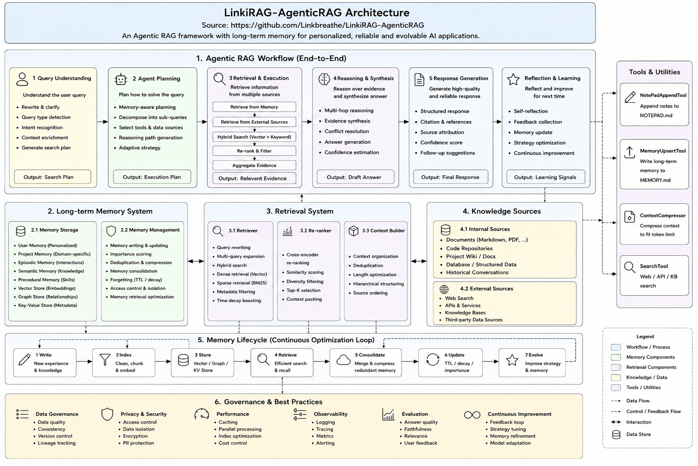

<p align="center">
  
</p>

<h1 align="center">Linki · Adaptive Agentic RAG</h1>

<p align="center">
  <strong>An evidence-grounded RAG assistant that spends compute only when a question needs it — and an honest, benchmark-backed study of when that actually pays off.</strong>
</p>

<p align="center">
  <a href="#overview">Overview</a> •
  <a href="#what-linki-explores">What it explores</a> •
  <a href="#what-is-implemented">What is implemented</a> •
  <a href="#experiments-and-results">Experiments & results</a> •
  <a href="#getting-started">Getting started</a> •
  <a href="#reproduce-the-benchmarks">Reproduce</a>
</p>

---

## Overview

Linki is a Python 3.12 knowledge assistant built on LangGraph, local FastEmbed
embeddings and Qdrant hybrid search. It answers questions with verbatim,
citation-checked evidence, and routes each request through a bounded **P0–P3**
policy so that cheap questions stay cheap and only genuinely hard ones pay for
planning and verification. Around that core it adds three governed side planes —
long-term memory, organizational knowledge, and a release-gated self-evolution
loop — so that user preferences, facts and model changes can only enter
production through explicit, auditable gates.

Just as important as the code is the **measurement**: Linki was benchmarked
against the official MultiHop-RAG corpus (609 articles, 2,556 questions, 47,593
vectors), and the results are reported here in full — including the parts where
the adaptive path did **not** clear its own quality bar. This README describes
both what was built and what the experiments actually showed.

---

## What Linki explores

The project is an attempt to answer a few concrete questions that most RAG demos
skip over:

1. **Can adaptive routing cut cost without losing quality?** A full agentic
   graph (plan → retrieve → grade → verify → reflow) gives good answers but is
   expensive. Can a cheap, local policy decide *per request* how much work to do,
   and recover most of the quality at a fraction of the tokens and latency?
2. **Does graph-based retrieval actually fix multi-hop recall?** Personalized
   PageRank over an entity↔document graph is often claimed to solve multi-hop
   questions. Does it, measurably, and at what cost?
3. **Does deterministic retrieval imply deterministic answers?** If the retriever
   returns the exact same evidence every time, are the model's *claims* also
   stable?
4. **Can memory, knowledge and self-evolution be governed instead of trusted?**
   Can a system version user memory, refuse to promote a model output to "fact,"
   and gate its own prompt/policy changes behind test → shadow → canary →
   rollback — rather than mutating state freely?

Every one of these is treated as a hypothesis with a pass/fail experiment, not a
marketing claim.

---

## What is implemented

Linki separates four concerns that RAG projects usually blur together.

### 1. Adaptive answer execution (P0–P3)

- A **local, explainable policy router** picks a bounded path *before* the first
  model call: **P0** local/chat (0–1 call) · **P1** retrieve + answer (1 call) ·
  **P2** plan once (≤3 calls) · **P3** bounded plan / grade / verify (≤7 calls).
- Every path carries `max_model_calls`, input-token, evidence, round and deadline
  budgets. Budget exhaustion degrades *explicitly* instead of looping forever.
- A deterministic risk gate decides whether the (expensive) verifier/reflow step
  is worth running, instead of always running it.
- `NodeCost` attributes model, prompt version, policy path, provider/estimated
  tokens and latency to **every** model call, with optional trace and cost
  persistence.

### 2. Retrieval and evidence integrity

- Dense + sparse **hybrid search** gathers 30 cheap child candidates
  (`BAAI/bge-small-en-v1.5` + `Qdrant/bm25`).
- A local cross-encoder (`Xenova/ms-marco-MiniLM-L-6-v2`, via FastEmbed) reranks,
  with an explicit lexical fallback that is surfaced in evidence metadata.
- The model receives **verbatim supporting spans** — never silently rewritten
  text — each keeping source version, content hash and validated character
  offsets (100% offset validity across the 2,556-question run).
- **Evidence Packs** enforce source diversity, sub-query coverage and
  path-specific token budgets (`1200 / 2400 / 4000`).
- `GraphRetriever` is an adapter boundary; a two-hop corpus PPR pilot plugs in as
  an experimental deep-path option (see the results below).

### 3. Governed memory & organizational knowledge

- Explicit user memory can become active; inferred memory starts as a candidate,
  and sensitive content requires review. Edit creates a new version; forget
  tombstones content and redacts recoverable episode payloads. Memory is isolated
  by tenant/user/ACL and injected only after retrieval, under a fixed budget.
- A **model output cannot become organizational fact.** Claims require a source
  artifact, a valid source span, schema checks and explicit approval. Claims are
  bitemporal (valid time + system-known time); Wiki and graph views are
  reproducible projections with staging, atomic promotion and rollback.

### 4. Release-gated self-evolution

- Feedback and failures become a **knowledge-gap backlog** — never invented
  answers. Prompt/policy/index candidates move through immutable evaluation
  results, deterministic canary buckets and constraint gates before promotion,
  with rollback available at every step.

### Runtime & cost controls

Async server entry point with single-flight coalescing for identical in-flight
requests; versioned exact answer/retrieval caches keyed by prompt, model, index,
memory, tenant, user and ACL (semantic answer caching **off** by default); SQLite
local cache backend with an optional Redis adapter; Qdrant embedded or
Server/Cloud.

### Architecture

<p align="center">
  
</p>

---

## Experiments and results

All numbers below come from a single reproducible run on the official
[MultiHop-RAG](https://github.com/yixuantt/MultiHop-RAG) corpus: **609 articles,
2,556 questions** (2,255 answerable + 301 null), **10,398 parent chunks / 47,593
child vectors**, serial execution on one machine with embedded Qdrant and the
reranker score cache disabled. Full protocol, per-type breakdowns and limitations
are in [`BENCHMARK_RESULTS.md`](BENCHMARK_RESULTS.md).

> **TL;DR:** Adaptive routing recovered most of the full graph's quality at
> ~1/4 of the tokens and ~1/5 of the latency — but it did **not** clear the strict
> evidence-chain quality floor, so `auto` ships on the legacy path by default and
> only *shadows* the adaptive decision. Graph PPR really does improve multi-hop
> recall, but at 2.5× the latency, so it stays a deep-path option. Deterministic
> retrieval did **not** produce deterministic answers.

### Experiment 1 — Retrieval: does reranking / graph PPR improve recall? (N=2,556)

| Variant | Recall | Strict all-support | MRR | Evidence tokens | p95 latency |
|---|---:|---:|---:|---:|---:|
| Frozen `legacy_k5` | 0.5858 | 0.2625 | 0.7539 | **744** | **0.672 s** |
| `rerank_pack` | 0.5994 | 0.2678 | 0.7520 | 1,278 | 1.076 s |
| `rerank_ppr` | **0.6348** | **0.3038** | **0.7807** | 1,620 | 2.397 s |

**Result.** Plain reranking barely moved recall (+1.36 pts) for +72% evidence and
+60% p95. Two-hop corpus PPR gained **+4.90 pts recall and +4.13 pts strict
all-support recall**, but cost **+257% p95 latency and +118% evidence volume**.
Even so, inference-type questions retrieved the *complete* support chain only
14.34% of the time — so graph retrieval helps, but has **not** "solved" multi-hop
inference. PPR is therefore an option for a selective deep path, not the default.

### Experiment 2 — End-to-end: can adaptive routing replace the full graph? (N=120)

Four systems on three disjoint 40-question folds (seeds `42 / 123 / 2026`; 30
comparison / inference / temporal / null each). Same main model
(`deepseek-chat`) and judge (`deepseek-reasoner`), temperature 0, caches and
memory off, per-row system order rotated to cancel warm/provider-order effects,
judge calls excluded from system cost, provider token usage available for 100% of
480 system calls.

| System | Calls | Mean tokens | p50 / p95 latency | Faithfulness | Quality | All-support | Refusal correct |
|---|---:|---:|---:|---:|---:|---:|---:|
| Fair single pass | **1.00** | **1,654** | **2.40 / 3.08 s** | **4.567** | 3.233 | 0.244 | 0.692 |
| Legacy full graph | 6.92 | 9,222 | 22.43 / 62.78 s | 4.417 | 3.592 | 0.433 | 0.650 |
| Adaptive auto | 1.26 | 2,440 | 4.14 / 6.95 s | 4.342 | **4.008** | 0.322 | **0.892** |
| Adaptive deep | 5.23 | 10,262 | 21.11 / 45.91 s | 4.267 | 3.475 | **0.467** | 0.675 |

**Result.** Against the same-row legacy graph, **adaptive auto** cut mean tokens
by **73.5%**, p50 latency by **81.5%** and model calls by **81.8%**, while
*improving* answer quality (+0.417), gold-answer containment (+0.100) and refusal
correctness (+0.242). The trade was strict evidence coverage: all-support recall
fell by 0.111.

### The release-gate verdict — why `auto` stays on the legacy path

The upgrade plan defined pass/fail gates in advance. Adaptive auto was measured
against them honestly:

| Gate | Result | Decision |
|---|---|---|
| Mean tokens ≥ 40% below full | −73.5% | **Pass** |
| p50 latency ≥ 35% below full | −81.5% | **Pass** |
| P1 median model calls ≤ 1 | 1 call over 96 P1 rows | **Pass** |
| Refusal-correct CI not below legacy −2 pts | +15.8 pts | **Pass** |
| All-support CI not below legacy −2 pts | −22.2 pts | **Fail** |
| P1 faithfulness ≥ fair single pass | 4.271 vs 4.469 | **Fail** |

Because two gates failed, **adaptive auto remains shadowed by default**: in
`auto`, Linki runs the legacy graph and *records* the P0–P3 choice as
`shadow_policy`, so the routing can be evaluated on live traffic without risking
answer quality. Callers can opt in per request with `--mode fast|balanced|deep`,
and operators can flip `adaptive_enabled` after calibrating on their own corpus.
Adaptive **deep** raised strict recall by 3.33 paired points, but its CI crossed
zero and it used 11.3% more tokens than legacy, so it stays an explicit
high-effort option too. This is the intended outcome of a gated design — the
faster path does not ship until it earns it.

### Experiment 3 — Stability: does stable retrieval mean stable answers?

Measured over 120 stratified questions × 3 runs at temperature 0:

- **Retrieval is deterministic:** top-k Jaccard `1.0`, exact-ranking rate `1.0`,
  error rate `0.0`.
- **Answers are not:** answer-claim Jaccard was only **`0.6928`** — just
  **57 / 120** questions were exactly stable, one scored zero. So identical
  evidence still yields drifting claims; deterministic retrieval does **not**
  imply deterministic answers.

### Governed-memory regression suite

A deterministic project-owned suite (not a claimed LongMemEval/LoCoMo score):
5/5 status decisions correct; write precision/recall, update correctness and
deletion completeness all `1.0`; stale-recall rate `0.0`.

### Honest limitations

- MultiHop-RAG covers comparison / inference / temporal / null queries only — not
  the planned single, multi-turn or cross-KB strata.
- Embedded Qdrant warns above ~20,000 points; these latencies are **not** a
  server-profile capacity claim. Use Qdrant Server/Cloud for the 47,593-vector
  index.
- Answer-claim Jaccard is lexical sentence overlap, **not** a claim-entailment
  metric; semantic paraphrases are scored as differences.
- Citation *index validity* only proves `[n]` points to a retrieved item, not
  that the claim is entailed by it.

---

## Getting started

Python **3.12+** and [`uv`](https://docs.astral.sh/uv/) are recommended.

```bash
git clone https://github.com/Linkbreathe/LinkiRAG-AgenticRAG.git
cd LinkiRAG-AgenticRAG
uv venv --python 3.12
uv pip install -e '.[ui]'

# Optional Redis adapter and evaluation dependencies:
uv pip install -e '.[ui,cache,eval]'
```

Create a git-ignored `.env`:

```dotenv
# DeepSeek
LINKI_PROVIDER=deepseek
DEEPSEEK_API_KEY=...
DEEPSEEK_MODEL=deepseek-chat
LINKI_JUDGE_PROVIDER=deepseek
LINKI_JUDGE_MODEL=deepseek-reasoner

# Or OpenAI / an OpenAI-compatible gateway:
# LINKI_PROVIDER=openai
# OPENAI_API_KEY=...
# LINKI_MODEL=gpt-4o-mini
# LINKI_PROVIDER=gateway
# LINKI_GATEWAY_BASE_URL=http://localhost:4000/v1
# LINKI_GATEWAY_API_KEY=...
```

Dense, sparse and cross-encoder models download on first use.

### Ask a question

```bash
# Ingest PDF or Markdown; a new immutable KB snapshot is promoted on success.
linki ingest ./docs/handbook.md --kb default --tenant acme --acl public

# Default auto = release-gated legacy path + recorded shadow_policy.
linki ask "What is the release policy?" --debug --tenant acme --user alice

# Explicit modes opt in to adaptive execution for this request.
linki ask "What is the release policy?" --mode fast
linki ask "Compare policy A and B" --mode balanced
linki ask "Strictly verify the complete evidence chain" --mode deep

# Multi-turn terminal session, and the web console.
linki
linki web   # http://127.0.0.1:7860
```

### Governance CLI

```bash
# Every command has detailed --help and JSON output where appropriate.
linki memory remember "Use TypeScript examples" --tenant acme --user alice
linki memory list --tenant acme --user alice

linki knowledge --help   # source-add, claim-propose/approve/reject, query, publish
linki wiki --help        # list / show / approve cited pages
linki evolve --help      # feedback, gaps, release gates, canary, rollback
```

The bundled React/TypeScript console exposes execution mode, tenant/user scope,
node costs, evidence, memory controls, Wiki pages and feedback. The FastAPI
backend also serves `/api/chat`, `/api/memory`, `/api/wiki`, `/api/feedback` and
`/api/gaps`.

### Configuration

Copy [`linki.yaml.example`](linki.yaml.example) to `linki.yaml`. Secrets stay in
`.env`; YAML holds runtime policy only.

| Setting | Default | Purpose |
|---|---:|---|
| `adaptive_enabled` | `false` | Keep `auto` on legacy while recording shadow policy; explicit modes still opt in. |
| `candidate_k / rerank_k` | `30 / 8` | Separate high-recall candidates from prompt evidence. |
| `evidence_budget_*` | `1200/2400/4000` | Fast / balanced / deep Evidence Pack limits. |
| `graph_retrieval` | `none` | `ppr_pilot` requires an injected graph adapter. |
| `enable_answer_cache` | `true` | Versioned exact cache for approved stable paths. |
| `enable_semantic_cache` | `false` | Enable only after corpus-specific false-hit calibration. |
| `enable_memory` | `true` | Governed recall/formation; tenant/user scoped. |
| `qdrant_url` | unset | Use Server/Cloud instead of embedded storage. |

---

## Reproduce the benchmarks

```bash
# Offline unit tests use fakes; no provider key needed.
uv run pytest -q

# Frontend type-check and bundle.
cd src/linki/ui/frontend && npm run build

# MultiHop-RAG, in an isolated namespace.
linki bench-prep --benchmark multihop-rag
linki bench-ingest --benchmark multihop-rag
linki bench-retrieval --benchmark multihop-rag --variant all
linki bench-fair --benchmark multihop-rag --fold-size 40
linki bench-stability --benchmark multihop-rag --limit 120 --seed 42 --repeats 3
linki bench-stability --benchmark multihop-rag --limit 120 --seed 42 --repeats 3 --with-answers
linki bench-memory
```

Benchmark commands checkpoint progress and reject checkpoints whose dataset or
protocol fingerprint differs. Raw answers and retrieved URLs stay under
`.linki/benchmarks/.../runtime/eval/` and are intentionally git-ignored.

### Browse the isolated benchmark corpus

The benchmark corpus is kept out of the default workspace so benchmark inputs,
gold labels, and everyday documents never mix. Launch its read-only workspace
on a separate port:

```bash
LINKI_CONFIG=benchmark-multihop.yaml uv run linki web --port 7861
```

Open `http://127.0.0.1:7861` to query the `kb_multihop` collection. This
switches the whole web instance to the benchmark corpus; evaluation reports
remain JSON artifacts under `.linki/benchmarks/multihop-rag/runtime/eval/`.

---

## Project layout

```text
src/linki/
├── routing/       local P0–P3 policy and deterministic risk gates
├── retrieval/     candidates, reranker, spans, Evidence Pack and graph protocol
├── graph/         adaptive/legacy LangGraph workflows and cited answer nodes
├── cache/         SQLite, Redis protocol and single-flight
├── memory/        immutable episodes, candidates, policy, consolidation, recall
├── knowledge/     sources, bitemporal claims, Wiki/graph projections, snapshots
├── evolution/     feedback, gap mining, candidate gates, canary and rollback
├── core/          provider factory, RequestContext, telemetry and trace
├── ingestion/     PDF/Markdown chunking, parent store and Qdrant indexing
├── eval/          fair E2E, retrieval, memory and stability protocols
├── ui/            FastAPI backend and bundled React/TypeScript console
└── cli/           Typer command surface
```

The full implementation plan and its open-source references are in
[`docs/Linki-AgenticRAG二次升级规划.md`](docs/Linki-AgenticRAG二次升级规划.md).

## Provenance and license

Linki combines the agentic patterns of the Linkbreathe `linki-agent-i` work with
hierarchical RAG ideas adapted from
[`agentic-rag-for-dummies`](https://github.com/GiovanniPasq/agentic-rag-for-dummies).
The adaptive routing, governance and evaluation layers live in this repository.

MIT — see [`LICENSE`](LICENSE).
